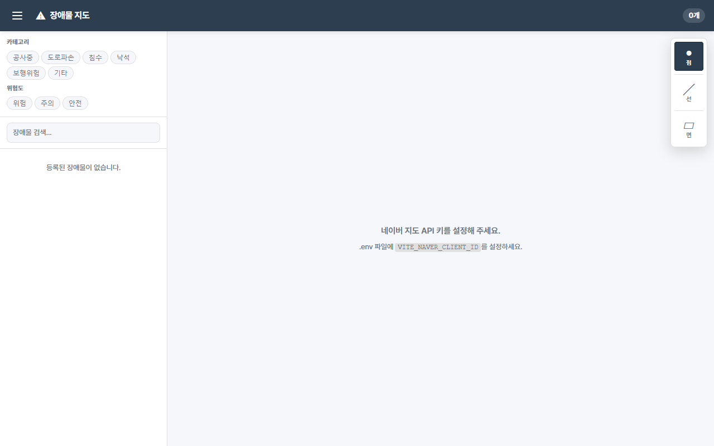
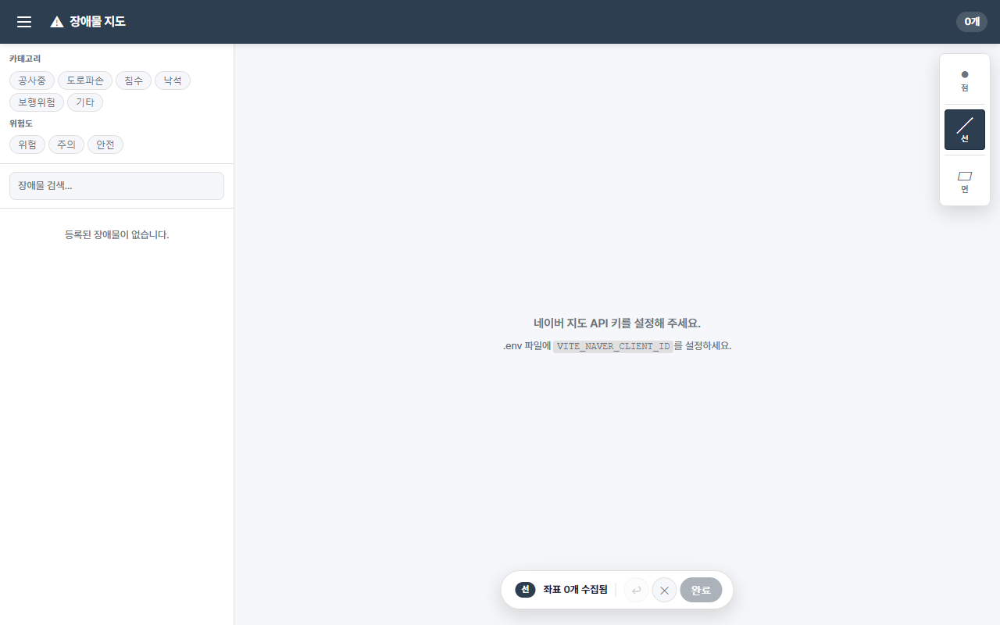
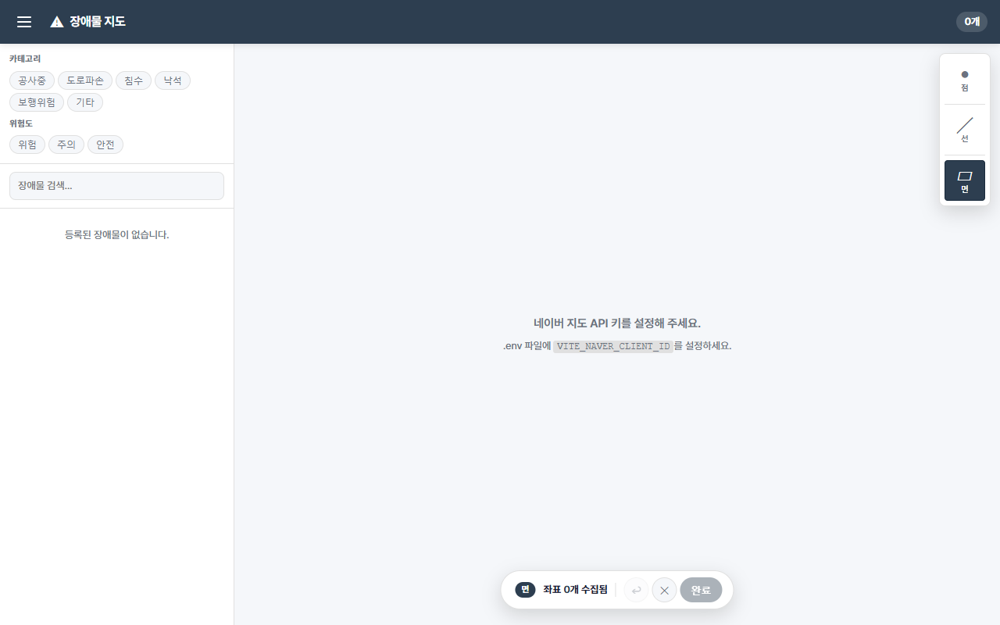

# Execution Log

## [Execute] 09:00 — executor

### 작업: 선(Line)/면(Polygon) 타입 추가

**구현 대상:**
1. `src/hooks/useDrawing.js` — 드로잉 모드 상태 관리 훅 (신규)
2. `src/components/Map.jsx` — Polyline/Polygon 렌더링 + 프리뷰 추가
3. `src/App.jsx` — drawMode 상태 + DrawToolbar/DrawStatusBar 연결
4. `src/components/ObstacleForm.jsx` — type/coordinates 표시
5. `src/components/MarkerList.jsx` — 타입 배지 표시

**TDD 순서:** 테스트 먼저 작성 → 실패 확인 → 구현 → 통과 확인

### 완료

**테스트 결과:**
```
Test Files  7 passed (7)
     Tests  59 passed (59)
  Duration  1.95s
```

**빌드 결과:**
```
vite v6.4.2 building for production...
✓ 50 modules transformed.
dist/index.html                  0.56 kB │ gzip:  0.38 kB
dist/assets/index-Bro2tyJS.css  16.65 kB │ gzip:  3.66 kB
dist/assets/index-BeLgk23E.js  165.81 kB │ gzip: 53.70 kB
✓ built in 517ms
```

**신규 파일:**
- `src/hooks/useDrawing.js`
- `src/test/useDrawing.test.js`

**수정 파일:**
- `src/components/Map.jsx` — coords/drawMode props, Polyline/Polygon 렌더링, 프리뷰 오버레이, DrawToolbar/DrawStatusBar 내부 렌더링
- `src/App.jsx` — useDrawing 훅 연결, handleMapClick 분기, draw 핸들러 추가, handleDeleteObstacle 분기
- `src/components/ObstacleForm.jsx` — type/coordinates 표시, handleSubmit에 type/coordinates 포함
- `src/components/MarkerList.jsx` — 타입 배지(점/선/면) 추가
- `src/components/MarkerList.module.css` — .typeBadge 스타일 추가
- `src/test/ObstacleForm.test.jsx` — line/polygon 타입 케이스 추가
- `src/test/MarkerList.test.jsx` — 타입 배지 케이스 추가

## [Review] 11:10 — reviewer

### 판정: FAIL (3건) + WARN (5건) — stage를 "execute"로 되돌림

**FAIL-1: DrawToolbar.jsx:13 — Fragment에 key prop 누락**
`.map()` 내 `<>` (shorthand Fragment)에 key를 줄 수 없어 React 콘솔 경고 발생.
수정: `<Fragment key={mode.key}>` 사용.

**FAIL-2: Map.jsx:109-147 — 프리뷰 오버레이 useEffect cleanup 함수 미반환**
컴포넌트 언마운트 시 previewPolyline/previewPolygon이 setMap(null) 되지 않아 메모리 누수 가능.
수정: effect에서 cleanup 함수 반환하여 preview refs를 setMap(null) 처리.

**FAIL-3: Map.jsx:271 — line/polygon InfoWindow 앵커에 방어적 fallback 누락**
obstacle.lat/lng가 undefined일 경우 LatLng 생성 실패 가능. App.jsx:63-64와 동일한 fallback 패턴 필요.
수정: `obstacle.lat ?? obstacle.coordinates?.[0]?.lat` 패턴 적용.

**WARN-1:** ADR의 필드명 `coords`와 실제 구현의 `coordinates` 불일치 — ADR 수정 권고.
**WARN-2:** Map.jsx:126,135 — early return 이후 중복 length 체크 — 제거 권고.
**WARN-3:** markersRef 고아 엔트리 — App.jsx에서 올바르게 처리되므로 현재 문제 없음.
**WARN-4:** handleDrawComplete에서 resetDrawing 즉시 호출 — 폼 취소 시 좌표 복구 불가 UX 트레이드오프 문서화 권고.
**WARN-5:** DrawStatusBar 완료 버튼의 접근성 개선(aria-describedby) 권고.

**PASS (10건):** 오버레이 삭제 cleanup, 리스너 해제, 프리뷰 취소, Point UX 호환, 경계 조건, 타입 안전성, 최소 diff, 테스트 커버리지, CSS, XSS 방어.

**ADR 검토 결과:** 보완 필요 — 결정 상태 "제안"→"확정" 승격, coords→coordinates 명칭 수정, 결정 3의 overlay 구조 실제 구현 반영 필요.

## [Execute-2] 11:10 — executor (리뷰 FAIL 수정)

리뷰어 FAIL 3건 수정 완료:
- FAIL-1: `DrawToolbar.jsx` — `<Fragment key={mode.key}>` 적용
- FAIL-2: `Map.jsx` — preview useEffect에서 cleanup 함수 반환 추가
- FAIL-3: `Map.jsx:282-283` — InfoWindow 앵커에 `obstacle.lat ?? obstacle.coordinates?.[0]?.lat` fallback 적용

## [Verify] 11:09 — verifier

### 빌드 결과
```
vite v6.4.2 building for production...
✓ 50 modules transformed.
dist/index.html                  0.56 kB │ gzip:  0.38 kB
dist/assets/index-Bro2tyJS.css  16.65 kB │ gzip:  3.66 kB
dist/assets/index-DVxltgu5.js  166.05 kB │ gzip: 53.74 kB
✓ built in 508ms
```

### 테스트 결과
```
Test Files  7 passed (7)
     Tests  59 passed (59)
  Start at  11:09:41
  Duration  1.64s
```

### 항목별 검증 결과
- 신규 파일 6개 존재: PASS
- open-questions.md [미결] 0개: PASS
- Map.jsx coords/drawMode props 사용: PASS
- Map.jsx preview useEffect cleanup 반환: PASS (line 148)
- App.jsx useDrawing import/사용: PASS
- ObstacleForm.jsx type/coordinates 처리: PASS
- MarkerList.jsx 타입 배지 표시: PASS (TYPE_LABEL + typeBadge span)

### 판정: PASS — mergeable

## [Screenshot] — UI 동작 증거

| 파일 | 설명 |
|------|------|
|  | DrawToolbar(점●/선╱/면▱) 우상단 표시, 점 모드 기본 활성화 |
|  | 선 버튼 활성화 + 하단 DrawStatusBar "선 좌표 0개 수집됨" 표시 |
|  | 면 버튼 활성화 + 하단 DrawStatusBar "면 좌표 0개 수집됨" 표시 |

- DrawStatusBar는 점 모드에서 숨겨짐 (조건부 렌더링 정상 동작)
- 완료 버튼은 좌표 0개 상태에서 비활성화 (최소 좌표 수 검증 정상 동작)
- 지도 영역 공백은 테스트 환경의 VITE_NAVER_CLIENT_ID 미설정에 의한 것 (정상)
